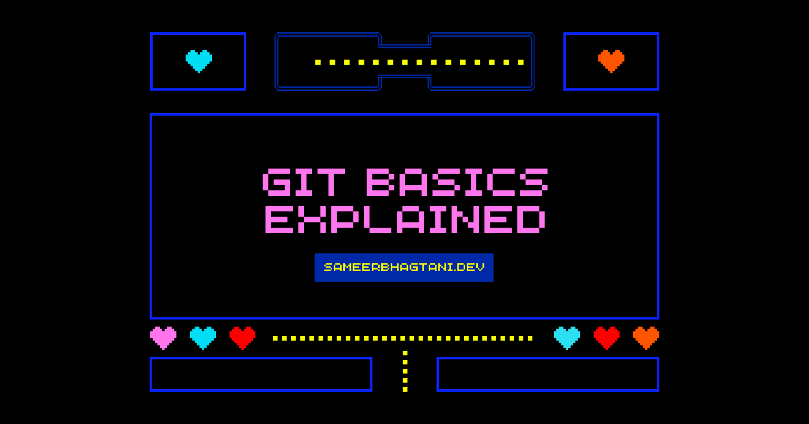
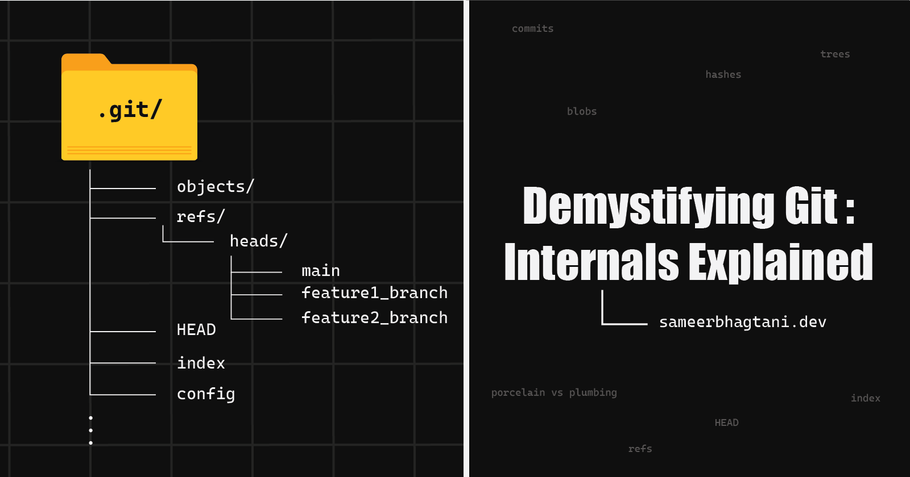

# ✍️ Week 00 (Orientation): Blog Posts

## 0. Why Version Control Exists: A Video Game Perspective

👉 **[Read on Hashnode](https://blog.sameerbhagtani.dev/why-version-control-exists)**

---

## 1. Learning Git Commands Through Video Game Mechanics

👉 **[Read on Hashnode](https://blog.sameerbhagtani.dev/learning-git-commands)**

---

## 2. Demystifying Git: Internals Explained

👉 **[Read on Hashnode](https://blog.sameerbhagtani.dev/demystifying-git-internals)**

---

[<- Back to Dashboard](../README.md)
