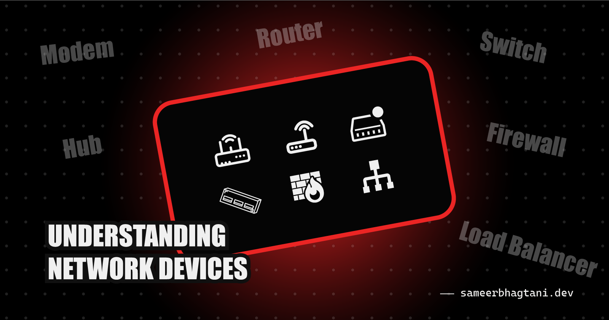
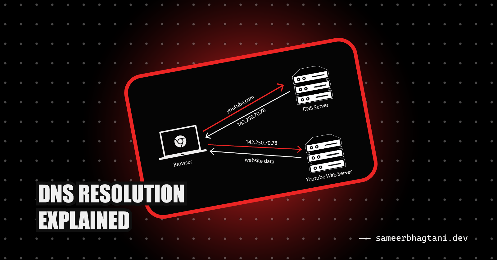
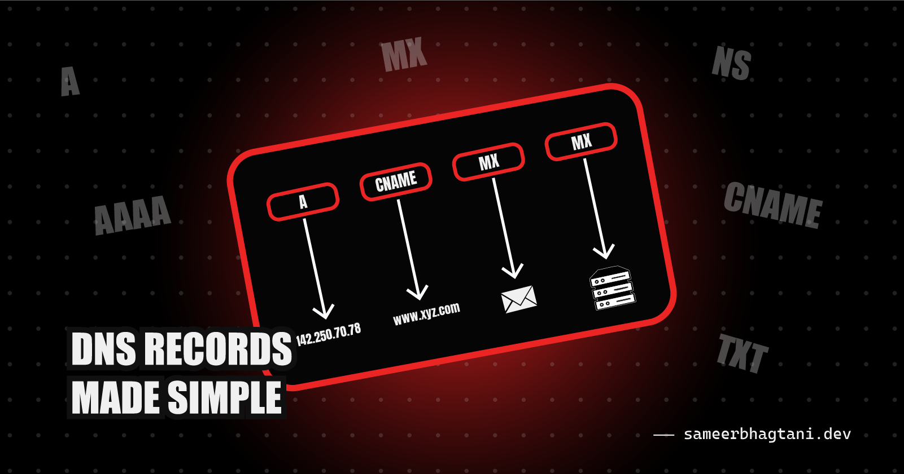
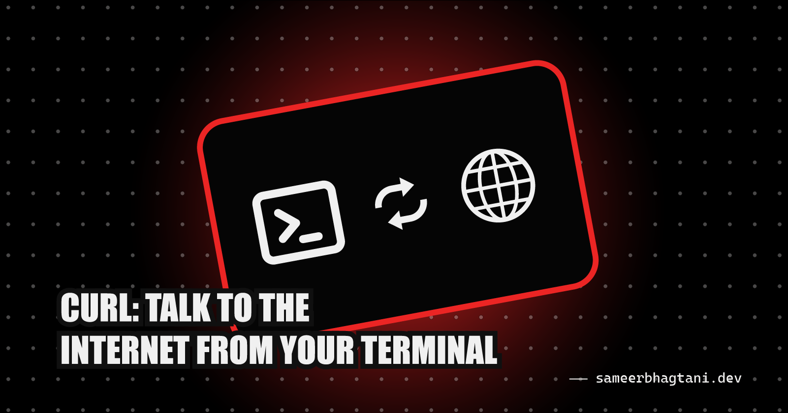
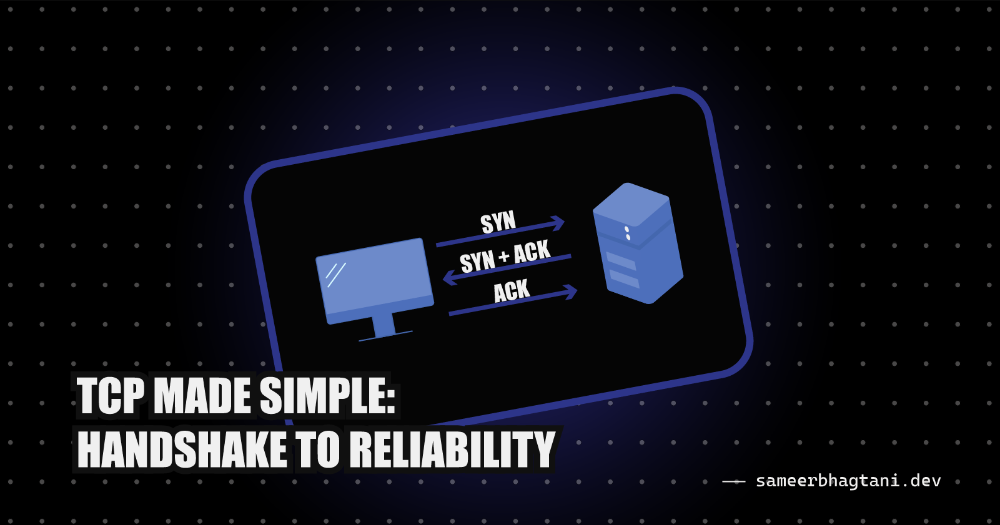
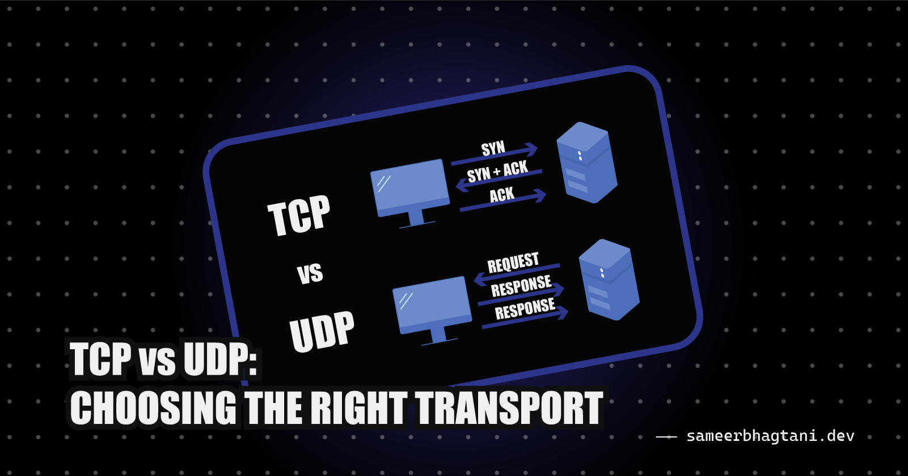

# ✍️ Week 01: Blog Posts

## 0. Understanding Network Devices: How Data Travels Across the Internet

👉 **[Read on Hashnode](https://blog.sameerbhagtani.dev/understanding-network-devices)**

---

## 1. DNS Resolution Explained: How Websites Reach Your Browser

👉 **[Read on Hashnode](https://blog.sameerbhagtani.dev/dns-resolution-explained)**

---

## 2. DNS Records Made Simple: A, AAAA, NS, CNAME, MX, TXT

👉 **[Read on Hashnode](https://blog.sameerbhagtani.dev/dns-records-made-simple)**

---

## 3. cURL Explained: Talk to the Internet from Your Terminal

👉 **[Read on Hashnode](https://blog.sameerbhagtani.dev/curl-explained)**

---

## 4. TCP Made Simple: Handshake to Reliability

👉 **[Read on Hashnode](https://blog.sameerbhagtani.dev/tcp-made-simple)**

---

## 5. TCP vs UDP: Choosing the Right Transport

👉 **[Read on Hashnode](https://blog.sameerbhagtani.dev/tcp-vs-udp)**

---

[<- Back to Dashboard](../README.md)
