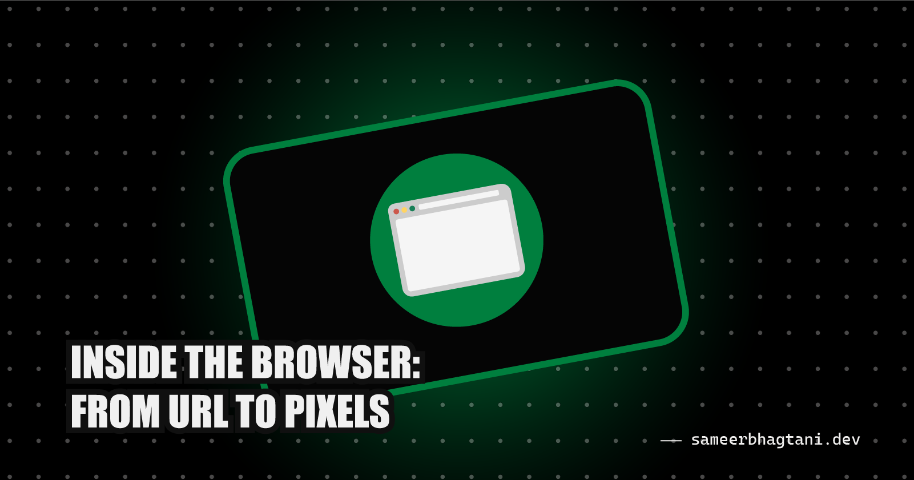
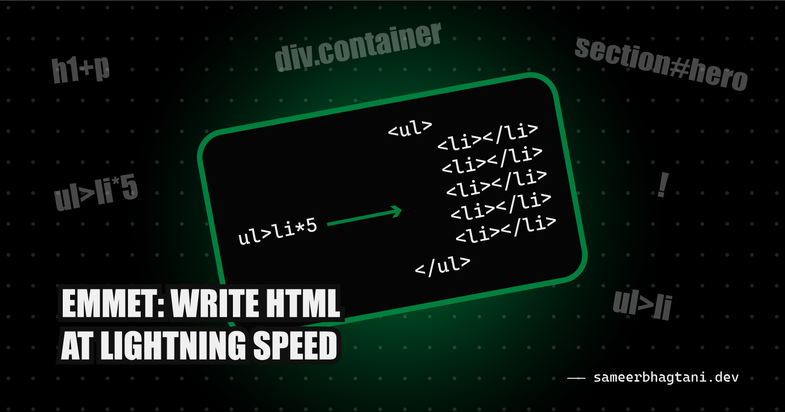
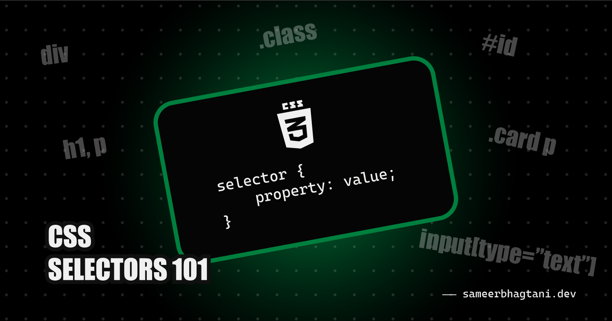

# ✍️ Week 02: Blog Posts

## 0. Inside the Browser: From URL to Pixels

👉 **[Read on Hashnode](https://blog.sameerbhagtani.dev/inside-the-browser)**

---

## 1. HTML Tags & Elements: The Building Blocks of Every Webpage

👉 **[Read on Hashnode](https://blog.sameerbhagtani.dev/html-tags-and-elements)**

---

## 2. Emmet for HTML: Write HTML at Lightning Speed

👉 **[Read on Hashnode](https://blog.sameerbhagtani.dev/emmet-for-html)**

---

## 3. CSS Selectors 101: Targeting Elements with Precision

👉 **[Read on Hashnode](https://blog.sameerbhagtani.dev/css-selectors-101)**

---

[<- Back to Dashboard](../README.md)
