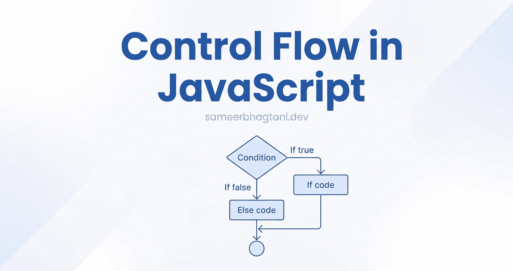
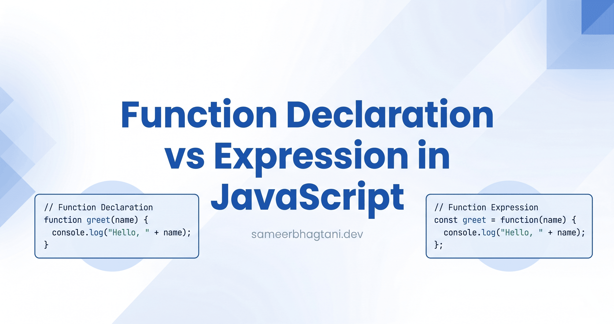
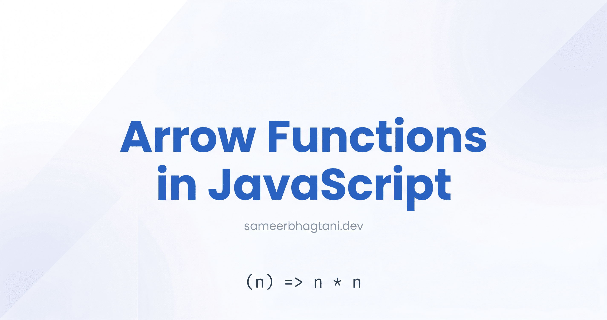
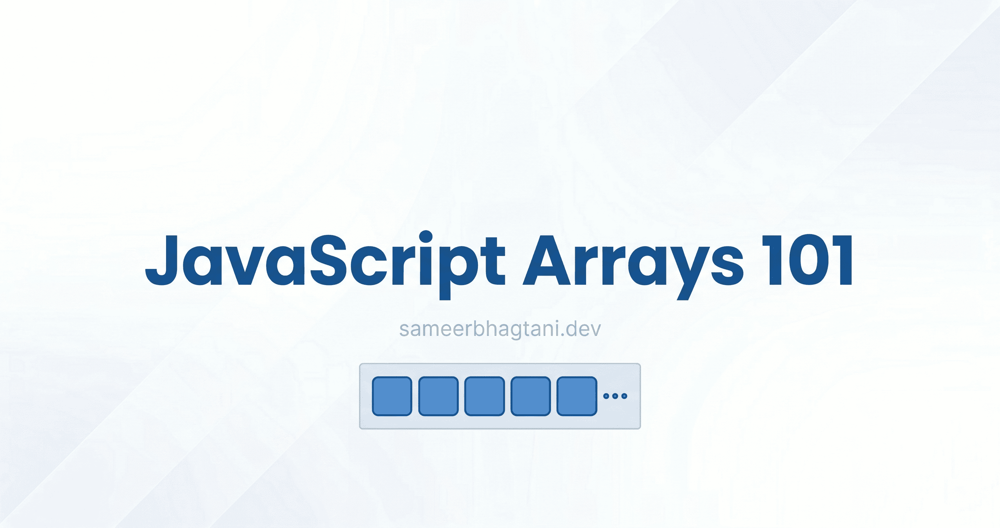
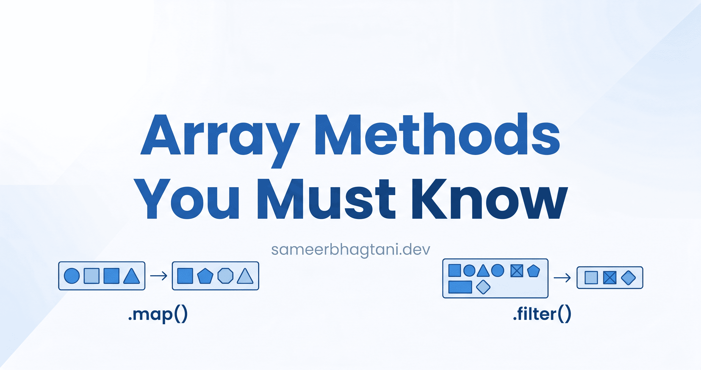
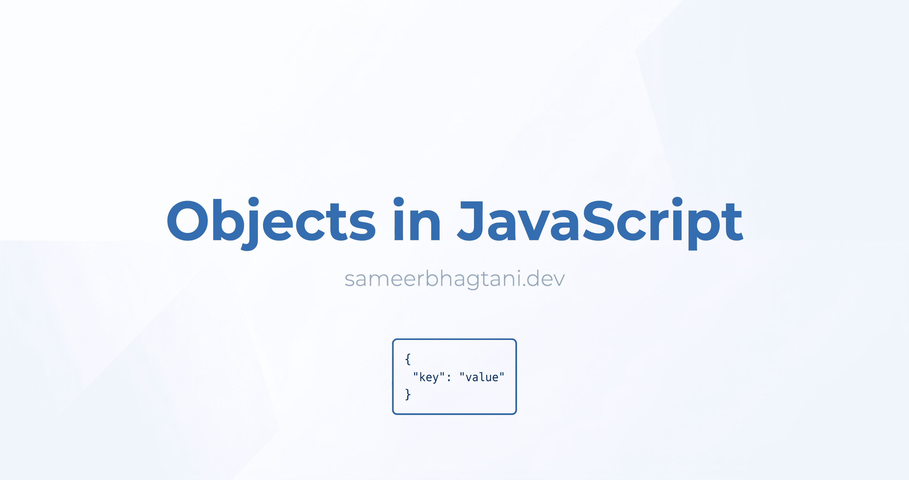
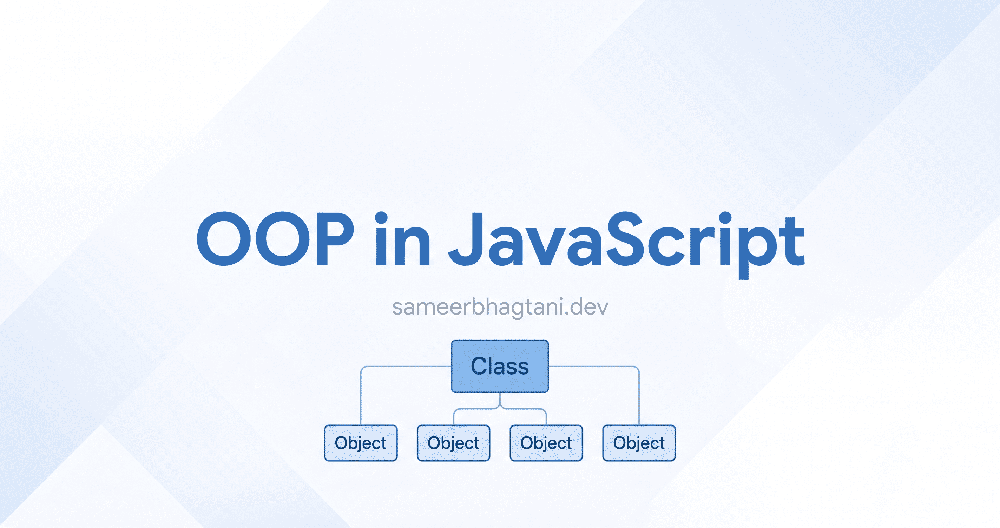
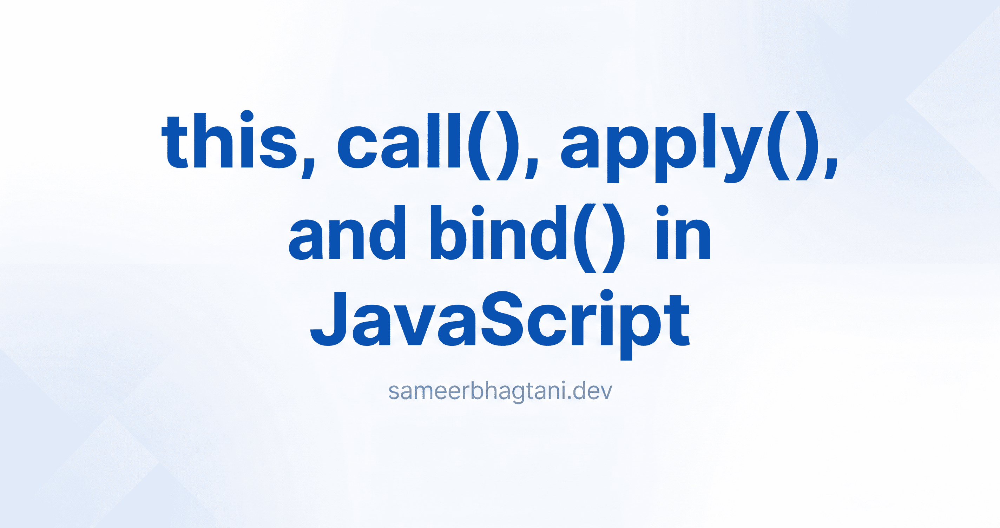

# ✍️ Week 06: Blog Posts

## 0. Variables and Data Types in JavaScript: A Beginner's Guide

👉 **[Read on Hashnode](https://blog.sameerbhagtani.dev/variables-and-data-types-in-javascript)**

---

## 1. Operators: Welcome to the JavaScript Cafe

👉 **[Read on Hashnode](https://blog.sameerbhagtani.dev/operators-in-javascript)**

---

## 2. Control Flow in JavaScript: if, else, and switch Explained

👉 **[Read on Hashnode](https://blog.sameerbhagtani.dev/control-flow-in-javascript)**

---

## 3. Function Declaration vs Function Expression in JavaScript

👉 **[Read on Hashnode](https://blog.sameerbhagtani.dev/function-declaration-vs-function-expression)**

---

## 4. Arrow Functions in JavaScript: Write Less, Mean More

👉 **[Read on Hashnode](https://blog.sameerbhagtani.dev/arrow-functions-in-javascript)**

---

## 5. JavaScript Arrays 101: Manage Multiple Values with Ease

👉 **[Read on Hashnode](https://blog.sameerbhagtani.dev/javascript-arrays-101)**

---

## 6. Array Methods You Must Know

👉 **[Read on Hashnode](https://blog.sameerbhagtani.dev/array-methods-you-must-know)**

---

## 7. Understanding Objects in JavaScript

👉 **[Read on Hashnode](https://blog.sameerbhagtani.dev/objects-in-javascript)**

---

## 8. Object-Oriented Programming in JavaScript

👉 **[Read on Hashnode](https://blog.sameerbhagtani.dev/oop-in-javascript)**

---

## 9. The Magic of this, call(), apply(), and bind() in JavaScript

👉 **[Read on Hashnode](https://blog.sameerbhagtani.dev/this-call-apply-and-bind-in-javascript)**

---

[<- Back to Dashboard](../README.md)
