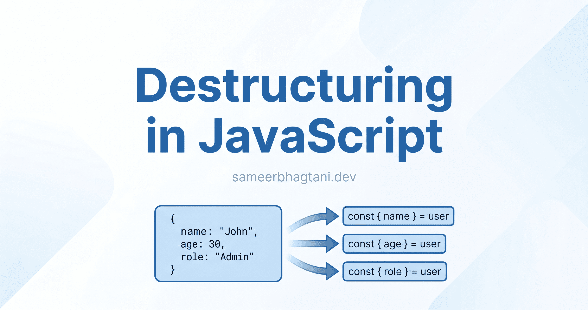
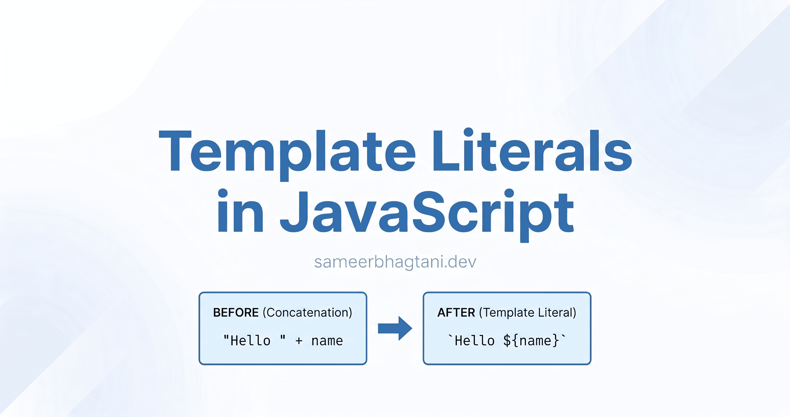

# ✍️ Week 09: Blog Posts

## 0. Spread vs Rest Operators in JavaScript

👉 **[Read on Hashnode](https://blog.sameerbhagtani.dev/spread-vs-rest-operators-in-javascript)**

---

## 1. Destructuring in JavaScript: Write Less, Read More

👉 **[Read on Hashnode](https://blog.sameerbhagtani.dev/destructuring-in-javascript)**

---

## 2. Array Flatten in JavaScript: Every Approach You Need to Know

👉 **[Read on Hashnode](https://blog.sameerbhagtani.dev/array-flatten-in-javascript)**

---

## 3. Map and Set in JavaScript: A Practical Guide

👉 **[Read on Hashnode](https://blog.sameerbhagtani.dev/map-and-set-in-javascript)**

---

## 4. Error Handling in JavaScript: Try, Catch, Finally

👉 **[Read on Hashnode](https://blog.sameerbhagtani.dev/error-handling-in-javascript)**

---

## 5. JavaScript Modules: Import and Export Explained

👉 **[Read on Hashnode](https://blog.sameerbhagtani.dev/javascript-modules-import-export-explained)**

---

## 6. Template Literals in JavaScript: Write Cleaner Strings

👉 **[Read on Hashnode](https://blog.sameerbhagtani.dev/template-literals-in-javascript)**

---

## 7. Understanding this in JavaScript

👉 **[Read on Hashnode](https://blog.sameerbhagtani.dev/understanding-this-in-javascript)**

---

[<- Back to Dashboard](../README.md)
